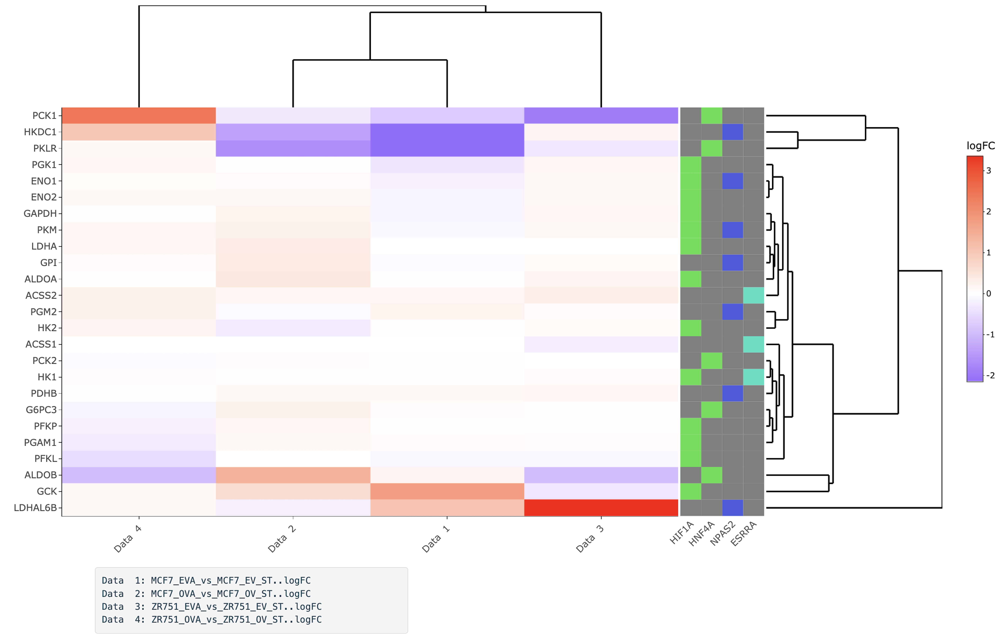
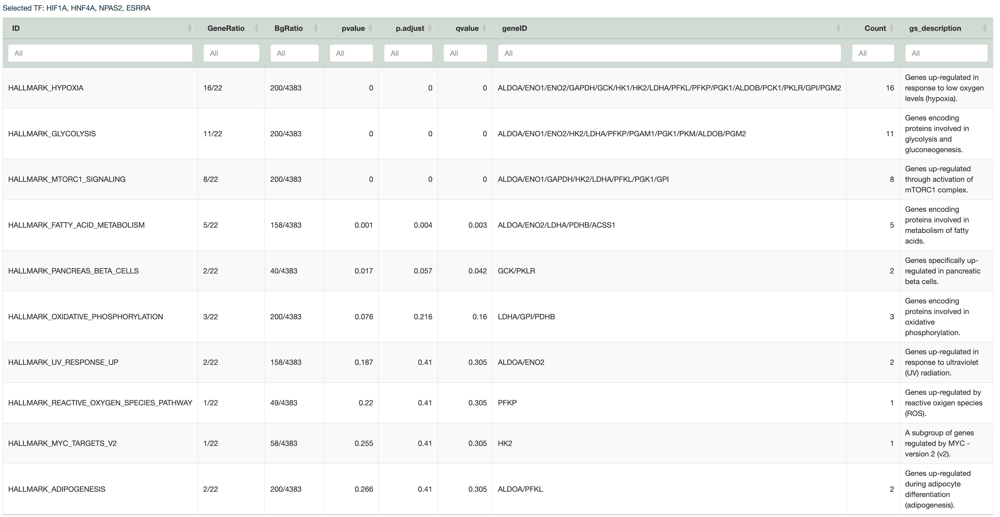
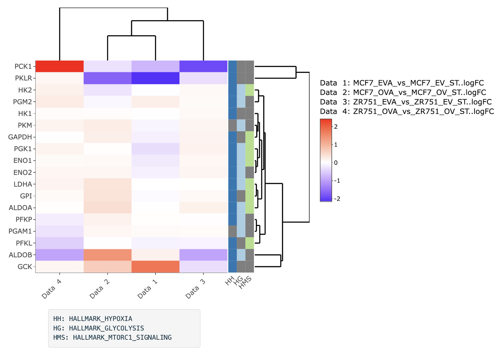
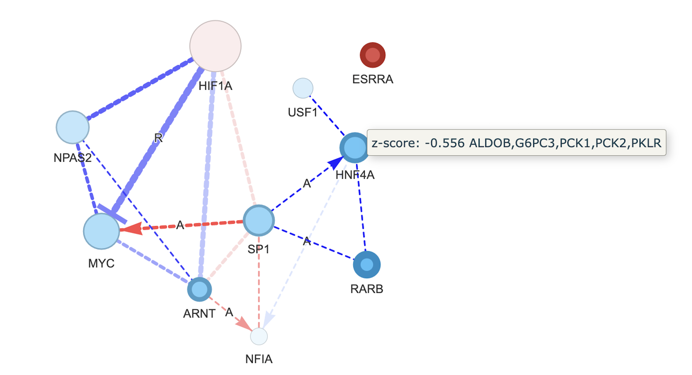

#### **Transcription Factors using** DoRothEA

Information for transcription factors were obtained using [**DoRothEA**](https://bioconductor.org/packages/release/data/experiment/html/dorothea.html) package of R. DoRothEA is a gene regulatory network that comprises signed interactions between transcription factors (TFs) and their target genes. These regulons, which consist of a TF and its associated transcriptional targets, were meticulously curated and assembled from various types of evidence.

It uses [**hypeR**](https://bioconductor.org/packages/release/bioc/html/hypeR.html)packageto perform hypergeometric geneset enrichment analyses. You can select "All" transcription factors or "NR targets" (Nuclear receptors only) transcription factors to carry out the analyses. Following the analysis, a ranking table is generated based on p-values, and a dot plot is created to visually represent the top 10 results, focusing on FDR (False Discovery Rate) values for an effective and concise presentation of the most significant findings.

When one or multiple rows of the resulting table are clicked, two possible actions can occur:

1.  An Interactive heatmap is generated for the genes listed in the "hit" column. This heatmap provides a visual representation of the expression profiles for these specific genes, offering insights into their differential expression patterns.

2.  An MSigDB analysis is performed. Clicking on the rows initiates a gene set enrichment analysis using the Molecular Signature Database (MSigDB) for the genes of selected terms. This analysis helps identify enriched gene sets and associated pathways, allowing you to gain a deeper understanding of the biological context related to the selected genes or terms.

**Example**

Heatmap displays the logFC values of the genes in each data comparison. In addition, there is an annotation section that displays the names of the TFs associated, along with their associated confidence scores. Different colors in the annotation part indicate different confidence levels.

{width="848"}

When the MSigDB part is selected, the platform conducts gene set enrichment analyses using the Molecular Signature Database (MSigDB), specifically focusing on the Hallmark collection. In this analysis, the genes associated with the selected TFs are utilized for this analysis, and the names of these selected TFs are included in the table caption for reference.

{width="903"}

When you click on one or multiple rows of the resulting table, an interactive heatmap is generated. This heatmap visualizes the logFC values of genes from the "geneID" column, providing insights into the expression changes of these genes.

The annotation part of the heatmap displays the selected terms as abbreviations, making the visualization more compact and informative for easy interpretation.

{width="598"}

#### **Network Visualization**

A network visualization is created for the TFs listed in the table. This network takes into account FDR values and the number of genes shared between any two TFs. In this network:

-   TFs are represented as nodes, with node size reflecting FDR or the number of overlapping genes.

-   Edges between nodes indicate the shared genes between two TFs and are represented by edge width.

-   Node and edge colors are determined by the z-score of logFC of target genes and the mean logFC of shared genes in the selected data. Red indicates values greater than zero, while blue represents values less than zero.

-   Node border width is based on the absolute z-score.

-   Node shape indicates significance from a Wilcoxon test, helping to determine if the average logFC values of genes targeted by a TF significantly differ from zero.

-   Information on the mode of regulation is indicated with arrows for activators and inhibitor lines for repressors. Dashed arrows represent repressors, and straight arrows indicate activators.

To maintain optimal performance, the network visualization tool is limited to displaying a maximum of 30 TFs at a time.

You have the option to refine the network by cutting edges based on a cutoff value for Jaccard similarity, the number or percentage of shared genes, or the absolute average mean logFC of shared genes between any two TFs. Significance based on the Wilcoxon test can also be used for network refinement.

**Example**

The network was constructed using the data from the first dataset, and it included the first 10 TFs. To simplify the network and enhance clarity, edges were pruned based on a shared genes percentage cutoff of 10%.

The interactivity of the network is enriched with informative tooltips:

-   When hovering over an edge in the network, it displays the mean logFC and the names of the genes that are shared by the connected TFs. This feature allows you to quickly understand the magnitude of change and the specific genes involved in the interaction.

-   When hovering over a node (representing a TF), the tooltip reveals the z-score and lists the names of genes that are targeted by that particular TF. This provides valuable information about the regulatory effects and the specific genes influenced by the TF.

Labelling edges with "R" and "A" indicates the repression or activation, respectively, between two TFs.

{width="829"}

------------------------------------------------------------------------
