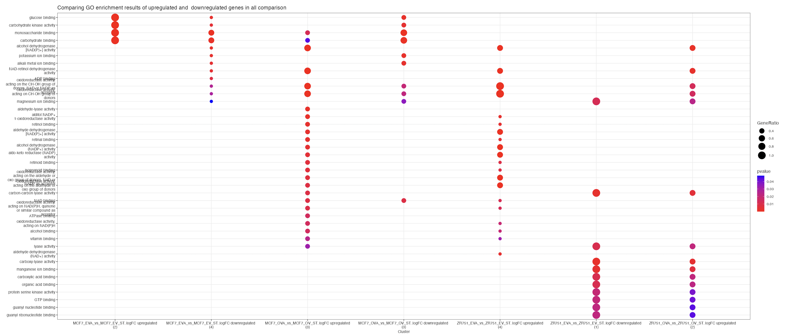

In the "Compare Cluster" tab, the selected comparisons are segregated into lists, distinguishing up-regulated and down-regulated genes within each. Using the compareCluster function from the [**clusterProfiler**](https://bioconductor.org/packages/release/bioc/html/clusterProfiler.html) package, a GO analysis is carried out for each list. The results, covering all lists of genes, are then presented in a dot plot format. In this visualization, GO terms are positioned along the y-axis, while the samples are arranged along the x-axis. This dot plot representation offers a holistic perspective, making it easy to grasp the enriched GO terms associated with both up-regulated and down-regulated gene sets within the chosen comparisons.

**Example**

When logFC thresold was selected as 1.2, it created up-regulated (above 1.2) and down-regulated (below -1.2) gene list for each comparison.

For example, we can see that while glucose binding is enriched in upregulated genes in first comparison, GTP binding is enriched in the genes of last comparison.

{width="1003"}

------------------------------------------------------------------------

Please note that any example is for representation purposes only and is not conclusive.
