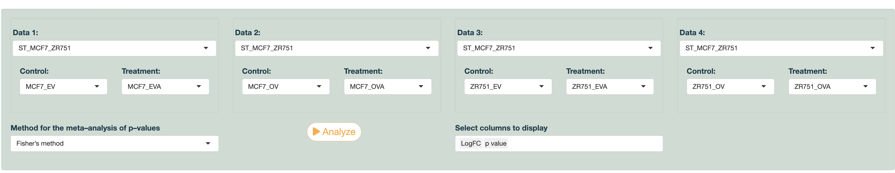
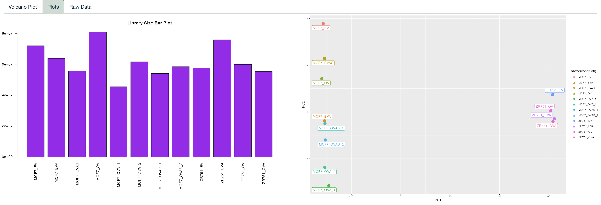

#### **Analyzing Datasets in eMRald**

Multiple (up to 4) RNA-seq/Microarray datasets can be chosen for simultaneous differential gene expression analyses to compare samples of interest.

Please check the *Data Explanation* tab to see details of each dataset included.

Note that the app allows for the user to utilize the Limma-Voom method for differential gene expression analysis and choose among its parameters to display as columns. A meta analysis will be conducted for the p-values across all selected datasets with the desired method and the resulting value for each gene will be added as an additional column. All meta analysis methods are provided by the [poolr](https://cran.r-project.org/web/packages/poolr/index.html) package.

**Example**

RNA-seq datasets from eMRald, which include MCF7 and ZR-75-1 cells transfected with MR vector or an empty vector, have been chosen to identify differentially expressed genes in response to Aldosterone (Aldo) treatment when compared to control samples.

{width="1232"}

------------------------------------------------------------------------

#### **Visualizing The Chosen Experiments**

When scrolled down the page, further insight into the attributes of samples within each of the chosen datasets are provided in separate tab panels.

The read counts of each sample can be checked by the *Library Size Bar Plot* for RNAseq, Box-and-whisker plot for Microarray data and the deviation among biological replicates can be seen by the *PCA*. It is also possible to check out and download the raw count data from the tab beside.

For each of these comparisons, eMRald also offers Volcano plots that allow for customizable options to visualize the differentially expressed genes.

**Example**

{width="879"}

Library size (left) and PCA plot (right) from our experiment)
