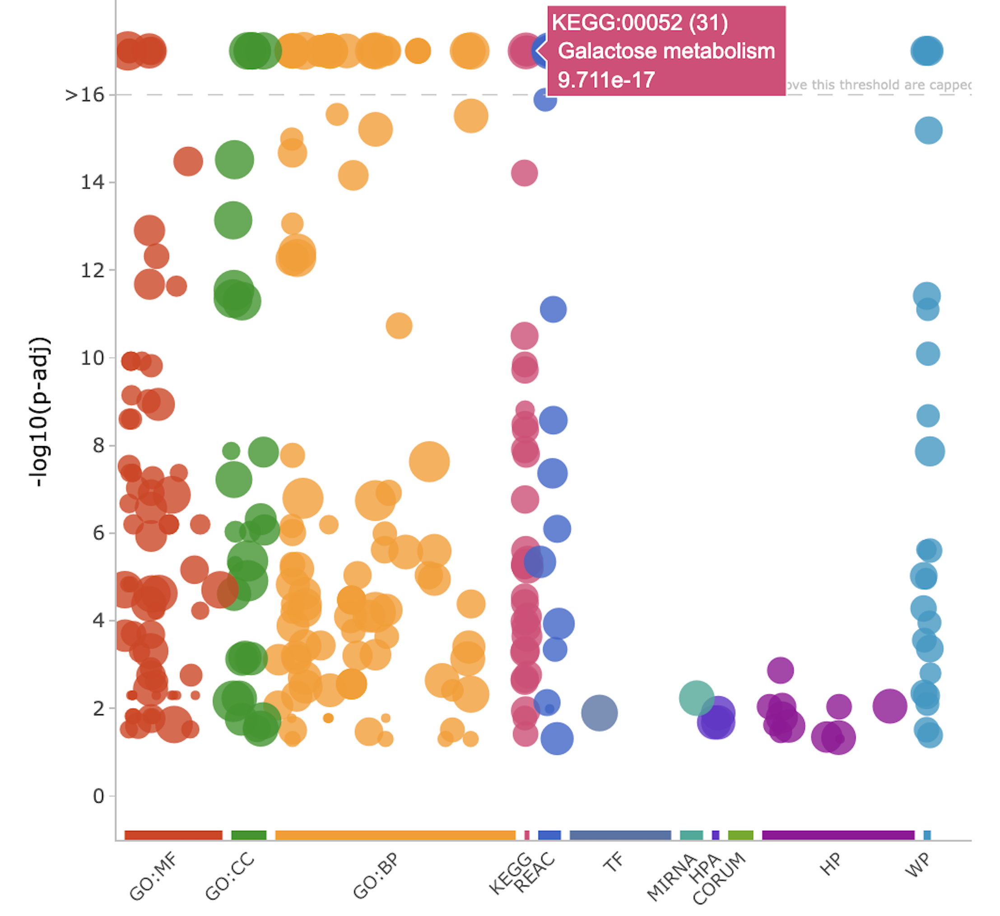
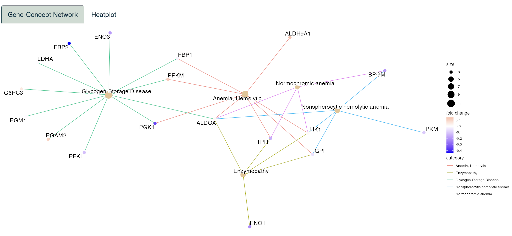
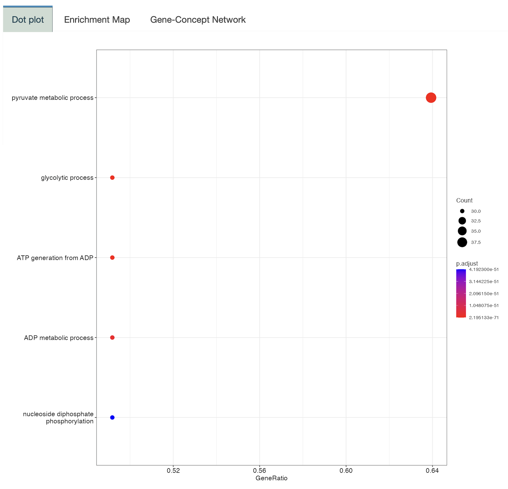
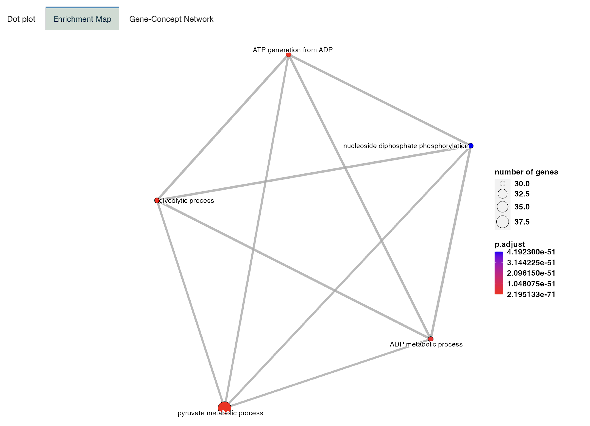
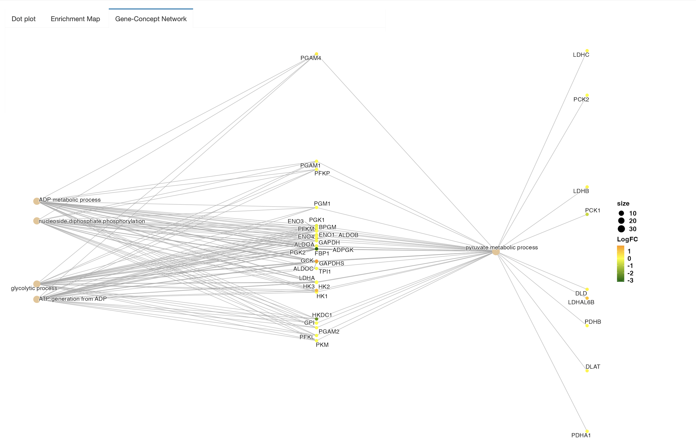

#### **Gost plot**

An interactive *Gost plot* which shows functional enrichment results from several data sources as a Manhattan plot can be created for the filtered gene set. Biological categories that are enriched in the differentially expressed gene set of interest are shown as circles with their p-values on the y-axis and the functional term they are involved in on the x-axis. Each functional term is positioned and colour coded. When you place your cursor over any data point, it will display the name of terms with the p-values.

**Example**

The most relevant KEGG pathway that is enriched in the previously filtered gene set is seen to be Galactose metabolism as expected.

{width="437"}

#### **DisGeNET**

The eMRald platform has integrated the *DisGeNET* database, which is one of the most extensive resources for genes and their associations with human diseases. This integration was accomplished using the [**DOSE**](https://academic.oup.com/bioinformatics/article/31/4/608/2748221) package and its enrichDGN function. When you select a subset of genes, you can utilize DisGeNet with optional parameters, including p-value, q-value filtering and a number of terms to display. This enables the creation of network-like visualizations or heatmaps.

In these visualizations, the nodes representing genes are colored based on the logFC values for the chosen comparison. This additional information helps you understand how the selected genes are linked to diseases and how their expression changes in the context of your specific comparison.

**Example**

A network diagram has been constructed for the 62 selected genes  using the logFC data from the first comparison by displaying 5 terms.

{width="867"}

#### 

#### **GO Enrichment Analysis**

A *GO Enrichment Analysis* can be done to obtain a comprehensive table of enriched molecular functions (MF), biological processes (BP) and cellular components (CC) based on the differentially expressed genes of interest. The gene counts associated with certain gene ontology terms will be provided with their gene IDs, ratios to the whole sample size, and p-values.

The table of Gene Ontology (GO) enrichment results can also be visually represented as graphical plots using the [**enrichplot**](https://bioconductor.org/packages/release/bioc/html/enrichplot.html) package. They can be visualized as a dotplot that enables a straightforward scoring, as a map that enables an organized view taking overlapping genes into account, and as a network plot with the desired layout. Several examples of these graphical representations are provided below as illustrations of the available visualization options.

**Example**

Plots were created for the first 5 enriched terms.

***Dot Plot***

{width="443"}

***Enrichment Map***

{width="585"}

***Gene-Concept Network***

{width="776"}

------------------------------------------------------------------------

Please note that any example is for representation purposes only and is not conclusive.
