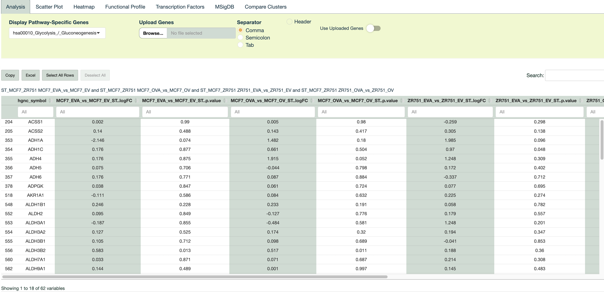
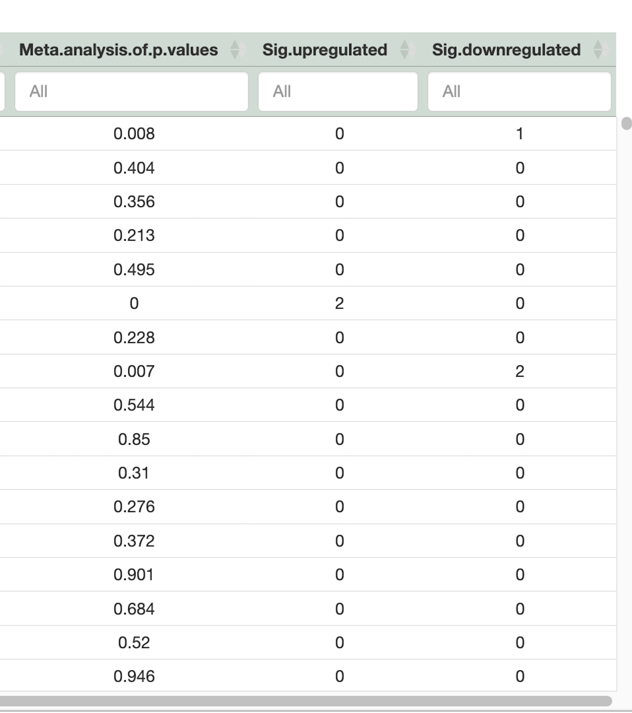

#### **Filtering and Visualizing Differentially Expressed Genes**

In the **Results** section, genes can be filtered by any of the displayed columns. It is also possible to constrict the gene set to a certain pathway of interest among KEGG pathways for a specific analysis. Also, you can provide your own gene list as txt file containing only gene names or as data frame which needs gene names to be in the first column. *Both KEGG pathway genes and user-specific gene list filtering cannot be used at the same time.*

The *select all rows* button helps store all the genes that suit the given filtrations. All selected rows will be added up to the resulting gene list displayed down the page (previous selections will be stored upon a new filtration). The number of genes that has been stored in the list can be checked by the selected row count that shows up below the table.

**Example**

A total of 62 genes from the Glycolysis/Gluconeogenesis KEGG pathway (hsa00010) have been selected.

{width="1114"}

In the last three columns of the table, you'll find the following information:

1.  **Meta-Analysis Result (P-values):** The first column presents the outcome of the meta-analysis of p-values. This result combines and assesses the significance of gene expression changes across different comparisons or datasets.

2.  **Number of Upregulated Comparisons:** The second column indicates how many comparisons show a gene to be significantly upregulated (with values greater than 0). It provides a count of the comparisons in which the gene exhibits upregulation.

3.  **Number of Downregulated Comparisons:** The third column displays the count of comparisons where a gene is significantly downregulated (with values less than 0). This column summarizes how many comparisons identify the gene as downregulated.

These columns together provide a concise summary of the statistical significance and direction of gene expression changes across various comparisons.

{width="311"}

