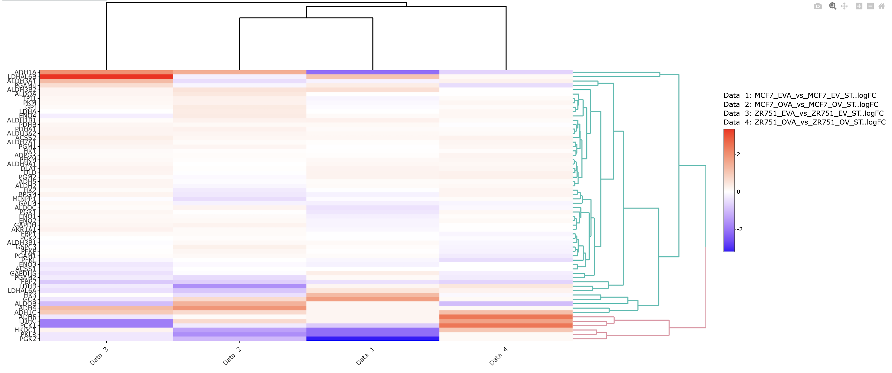

A differential gene expression heatmap can be drawn after the selection of the genes. The samples can be clustered with the desired distance measure and linkage method. The interactive heatmap that shows the logFC value of each corresponding gene on the dendogram is generated by utilizing the [heatmaply](https://cran.r-project.org/web/packages/heatmaply/vignettes/heatmaply.html) package and can be exported as an html file.

**Example**

The previously filtered gene set is clustered based on Euclidean distance using complete linkage clustering for generating an expression heatmap.

In the heatmap, the comparisons are labeled as Data 1, Data 2, Data 3, and Data 4. Their corresponding names are displayed above the color legend.

{width="952"}

The number of clusters can be increased for further specification of gene groups having similar patterns of expression.

------------------------------------------------------------------------

 Please note that any example is for representation purposes only and is not conclusive. 
