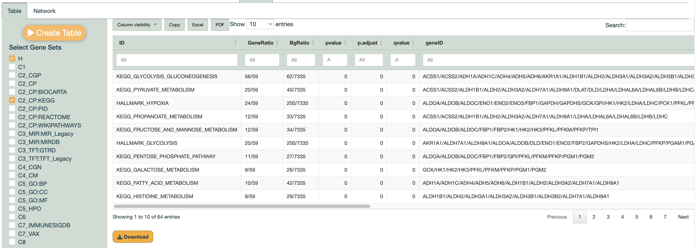
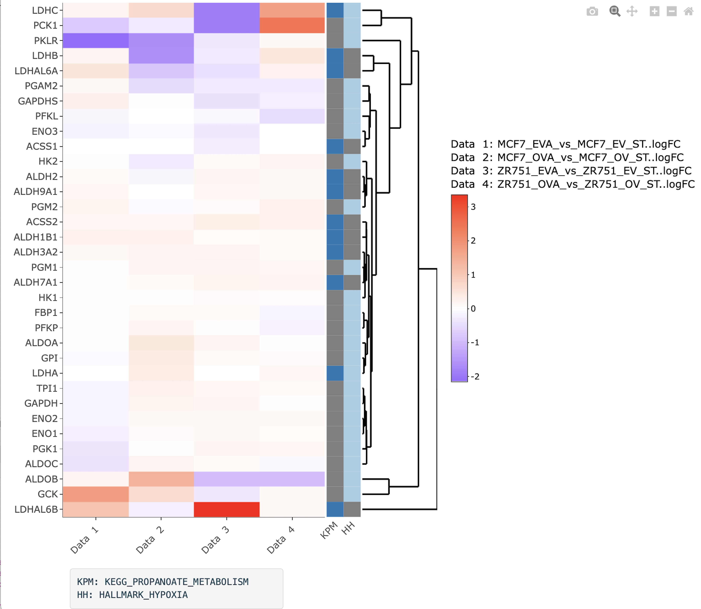
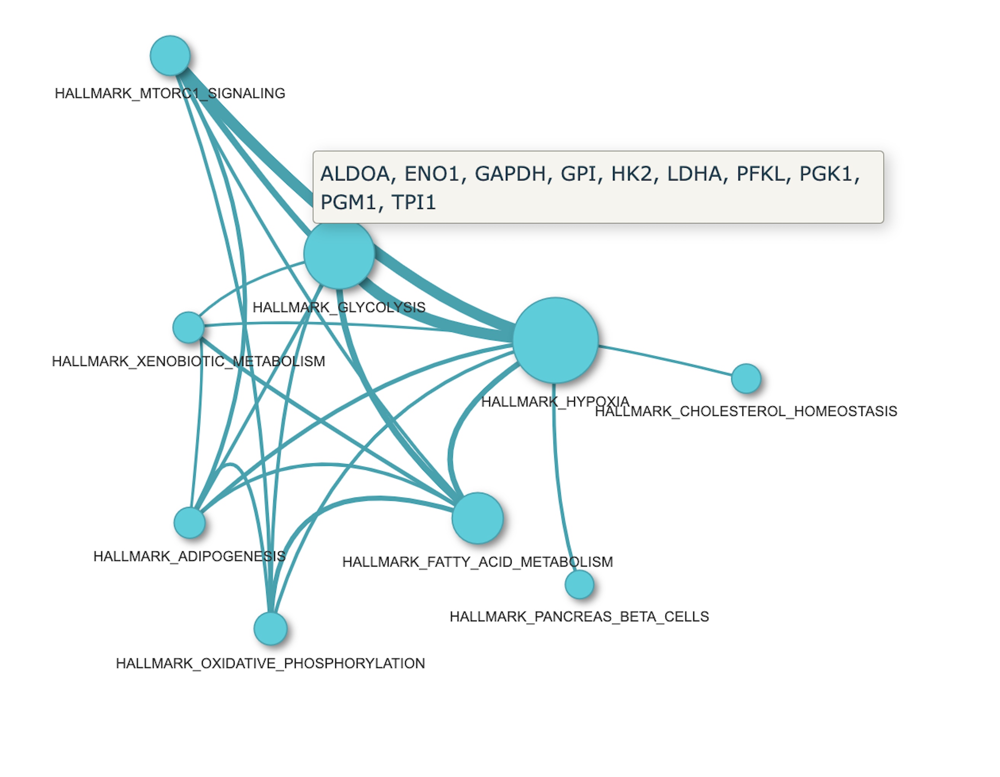

Collections of gene sets from the Molecular Signature Database provided by the [msigdbr](https://cran.r-project.org/web/packages/msigdbr/vignettes/msigdbr-intro.html) package can be utilized for a gene set enrichment analysis on the genes of interest. The abbreviations can be checked to see which gene set they stand for by clicking onto the *MSigDB Collections* button.

**Example**

Hallmark gene sets and KEGG pathways are selected among the collections for this example.

As expected, it's not surprising that the top enriched term is "KEGG glycolysis and gluconeogenesis", since our gene list was originally filtered from this specific pathway at the beginning of our analysis.

{width="1533"}

When clicked on two terms, it generates an interactive heatmap. The abbreviated terms corresponding to these selections are displayed below the heatmap, making it easier to interpret and understand the visual representation of the data.

{width="378"}

Network can be also generated for any terms such as H (Hallmark) or C2 (KEGG) in this case. Below figure was generated using only H. When hovering over an edge in the network, it displays the names of the genes that are shared by the connected terms.

{width="568"}

------------------------------------------------------------------------

Please note that any example is for representation purposes only and is not conclusive.
