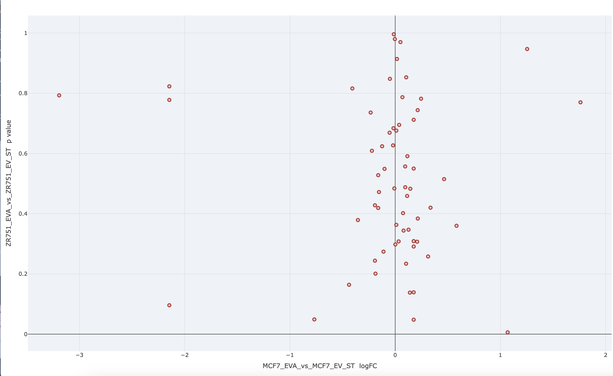

After the selection of the genes, you can create a interactive scatter plot to visualize the correlation between the differential expression profiles of the experiments of interest. In this scatter plot, you can use the logFC (logarithm of fold change) or p-value columns from the resulting table as the axes to assess how the experiments correlate with each other in terms of gene expression changes. When you place your cursor over any data point, it will display the gene name along with the corresponding values on the axes. Additionally, you can choose to visualize the entire gene set, providing a comprehensive view of the expression patterns across all selected genes.

**Example**

Scatter plot was created for selected 62 genes, where the x-axis represents the logFC column from the MCF-7 EVA vs. EV comparison, and the y-axis represents the logFC column from the ZR-75-1 EVA vs. EV comparison.

{width="826"}

------------------------------------------------------------------------

Please note that any example is for representation purposes only and is not conclusive.
